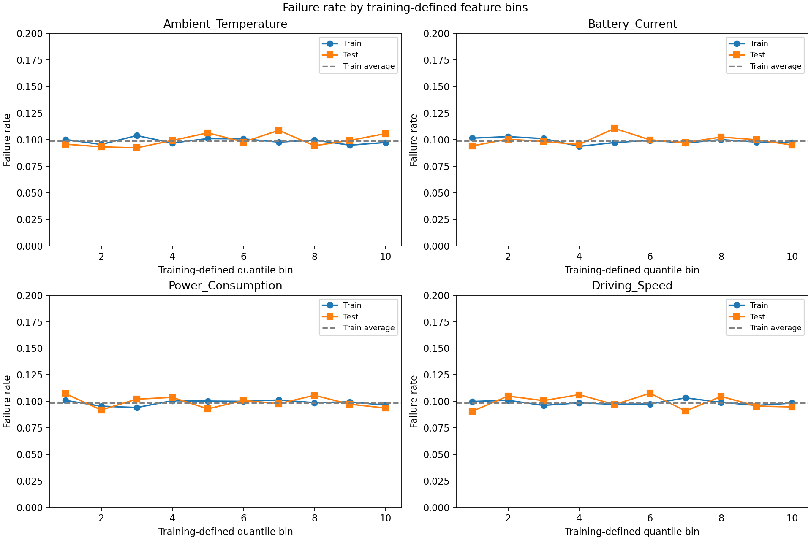
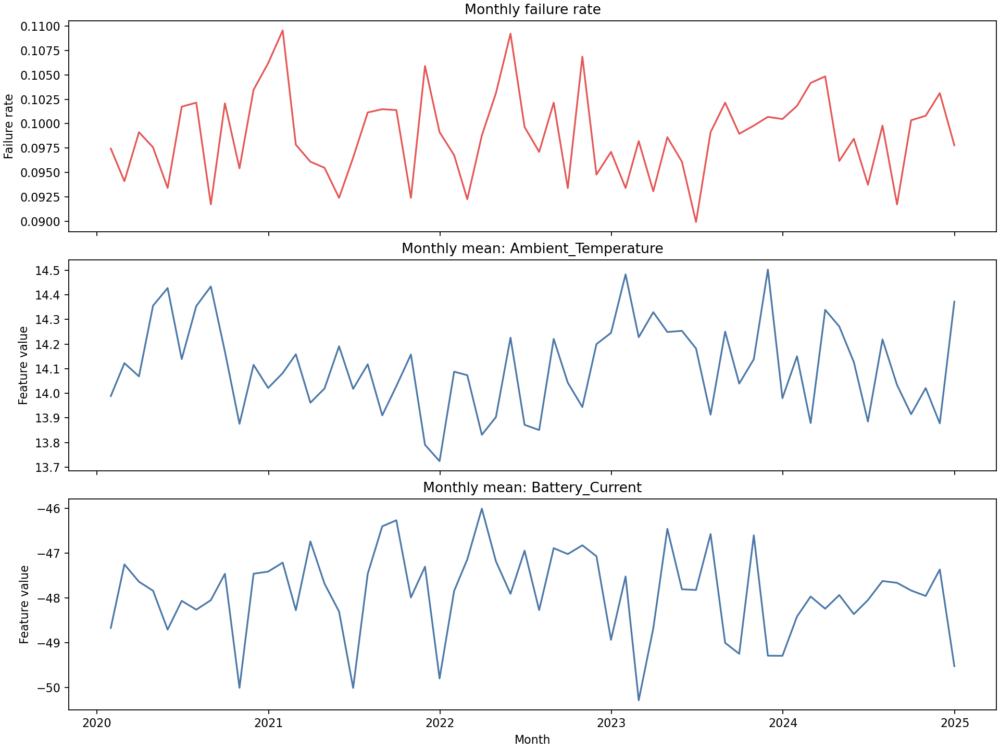

# Failure-Signal Analysis

## Scope

This investigation asks whether the fixed 24 approved Model 1 operational inputs contain observable information for distinguishing the documented binary target `Failure_Probability` (`0 = No Failure`, `1 = Failure`). It is descriptive only: it does **not** train a classifier, change the baseline model, tune a threshold, resample with SMOTE, engineer features, or modify the raw CSV.

The input allowlist is unchanged: `SoC`, `SoH`, `Battery_Voltage`, `Battery_Current`, `Battery_Temperature`, `Charge_Cycles`, `Motor_Temperature`, `Motor_Vibration`, `Motor_Torque`, `Motor_RPM`, `Power_Consumption`, `Brake_Pad_Wear`, `Brake_Pressure`, `Reg_Brake_Efficiency`, `Tire_Pressure`, `Tire_Temperature`, `Suspension_Load`, `Ambient_Temperature`, `Ambient_Humidity`, `Load_Weight`, `Driving_Speed`, `Distance_Traveled`, `Idle_Time`, and `Route_Roughness`.

`Timestamp`, the target, `Maintenance_Type`, `RUL`, `TTF`, and `Component_Health_Score` remain excluded from `X`. The analysis is not evidence that any retained input is safe at a real prediction time; that availability question remains unresolved in the dataset documentation.

## Analysis design

The data were ordered by `Timestamp` and split chronologically without shuffling:

| Partition | Rows | Failures | Failure rate | Use in this analysis |
| --- | ---: | ---: | ---: | --- |
| Earliest 80% | 140,314 | 13,850 | 9.8707% | Class comparisons, association measures, bin definitions, and pair exploration |
| Latest 20% | 35,079 | 3,482 | 9.9262% | Check whether earlier bin patterns visibly persist |

This preserves the baseline's chronology. Individual statistics and pairwise discoveries are calculated on the earlier partition. For the nonlinear checks, quantile-bin cut points are learned from that earlier data only, then applied unchanged to the later data. The holdout is not used to fit a transformation or train a model.

For every feature, the investigation calculates class-specific mean, median, sample standard deviation, and 5th/25th/75th/95th percentiles. It also calculates:

- Cohen's *d*: standardized difference between the two class means.
- Point-biserial correlation with the binary label: a linear association measure.
- Orientation-neutral univariate ROC-AUC: `0.5` means one feature cannot rank the classes better than chance, regardless of whether a high or low value is associated with the label.
- Mutual information estimated on the training partition: a non-linear dependence screen, not a model score or causal measure.

## Distribution comparison for all approved features

Each cell below is `mean / median / SD / P05–P95`, calculated on the earliest 80%. Different features use different units, so values should be compared only across the two classes within the same row.

| Feature | No Failure, 0 | Failure, 1 |
| --- | --- | --- |
| `SoC` | 0.780 / 0.883 / 0.292 / 0.065–0.988 | 0.785 / 0.883 / 0.287 / 0.073–0.990 |
| `SoH` | 0.883 / 0.941 / 0.164 / 0.466–0.994 | 0.882 / 0.941 / 0.165 / 0.465–0.994 |
| `Battery_Voltage` | 352.680 / 370.632 / 55.329 / 216.655–397.046 | 352.717 / 370.557 / 55.080 / 217.154–396.905 |
| `Battery_Current` | -47.787 / -33.515 / 45.234 / -165.673–-12.337 | -48.397 / -33.669 / 45.826 / -167.399–-12.306 |
| `Battery_Temperature` | 33.384 / 30.891 / 8.635 / 25.586–54.989 | 33.408 / 30.847 / 8.685 / 25.545–55.048 |
| `Charge_Cycles` | 217.751 / 158.958 / 164.469 / 105.890–633.882 | 216.903 / 158.353 / 164.338 / 105.611–634.885 |
| `Motor_Temperature` | 56.023 / 51.758 / 15.435 / 41.174–93.288 | 55.957 / 51.729 / 15.440 / 41.155–93.310 |
| `Motor_Vibration` | 0.523 / 0.376 / 0.433 / 0.217–1.666 | 0.529 / 0.379 / 0.438 / 0.218–1.682 |
| `Motor_Torque` | 179.805 / 158.771 / 76.815 / 105.920–366.433 | 179.335 / 159.191 / 75.935 / 105.687–363.306 |
| `Motor_RPM` | 2234.967 / 1793.576 / 1187.779 / 1529.294–5330.105 | 2247.039 / 1798.287 / 1199.604 / 1530.423–5381.388 |
| `Power_Consumption` | 31.700 / 25.860 / 16.407 / 20.590–73.305 | 31.673 / 25.898 / 16.326 / 20.570–73.114 |
| `Brake_Pad_Wear` | 0.298 / 0.217 / 0.241 / 0.112–0.901 | 0.297 / 0.216 / 0.240 / 0.112–0.893 |
| `Brake_Pressure` | 46.053 / 41.778 / 15.440 / 31.159–83.270 | 45.897 / 41.686 / 15.296 / 31.132–83.476 |
| `Reg_Brake_Efficiency` | 0.819 / 0.862 / 0.141 / 0.467–0.941 | 0.818 / 0.862 / 0.142 / 0.465–0.940 |
| `Tire_Pressure` | 31.004 / 32.066 / 3.848 / 21.667–34.702 | 30.965 / 32.018 / 3.865 / 21.595–34.695 |
| `Tire_Temperature` | 32.983 / 30.885 / 7.690 / 25.593–51.697 | 32.966 / 30.808 / 7.724 / 25.572–51.600 |
| `Suspension_Load` | 195.285 / 159.055 / 111.156 / 105.942–466.968 | 196.072 / 159.021 / 112.333 / 105.622–468.854 |
| `Ambient_Temperature` | 14.117 / 16.193 / 9.043 / -6.624–24.114 | 14.048 / 16.119 / 9.055 / -6.865–24.113 |
| `Ambient_Humidity` | 47.090 / 41.759 / 17.823 / 31.164–89.933 | 47.266 / 41.851 / 17.919 / 31.160–90.060 |
| `Load_Weight` | 899.209 / 793.073 / 384.466 / 529.116–1829.255 | 899.092 / 791.287 / 385.274 / 529.866–1835.194 |
| `Driving_Speed` | 58.262 / 51.748 / 20.603 / 41.176–109.923 | 58.185 / 51.773 / 20.562 / 41.198–110.017 |
| `Distance_Traveled` | 15.423 / 5.881 / 25.667 / 0.590–83.280 | 15.532 / 5.869 / 25.817 / 0.587–83.882 |
| `Idle_Time` | 1.546 / 0.585 / 2.574 / 0.059–8.342 | 1.572 / 0.583 / 2.606 / 0.059–8.414 |
| `Route_Roughness` | 0.298 / 0.218 / 0.241 / 0.112–0.900 | 0.294 / 0.217 / 0.237 / 0.112–0.893 |

The class distributions substantially overlap for every feature. The additional 25th and 75th percentile measurements recorded by the reusable analysis code show the same result: there is no material class shift in the central distribution.

## Association measures for all approved features

| Feature | Cohen's *d* | Target correlation | Univariate ROC-AUC | Mutual information |
| --- | ---: | ---: | ---: | ---: |
| `SoC` | 0.0190 | 0.0057 | **0.5065** | 0.000000 |
| `Route_Roughness` | -0.0142 | -0.0042 | 0.5040 | 0.000068 |
| `Battery_Current` | -0.0135 | -0.0040 | 0.5039 | 0.001194 |
| `Motor_Vibration` | 0.0126 | 0.0038 | 0.5050 | 0.000689 |
| `Brake_Pressure` | -0.0102 | -0.0030 | 0.5010 | 0.000000 |
| `Motor_RPM` | 0.0102 | 0.0030 | 0.5049 | 0.000000 |
| `Idle_Time` | 0.0101 | 0.0030 | 0.5017 | 0.000000 |
| `Tire_Pressure` | -0.0100 | -0.0030 | 0.5042 | 0.000044 |
| `Ambient_Humidity` | 0.0099 | 0.0029 | 0.5032 | 0.000000 |
| `Ambient_Temperature` | -0.0076 | -0.0023 | 0.5032 | **0.001247** |
| `Suspension_Load` | 0.0071 | 0.0021 | 0.5003 | 0.000168 |
| `Motor_Torque` | -0.0061 | -0.0018 | 0.5007 | 0.000160 |
| `Reg_Brake_Efficiency` | -0.0062 | -0.0018 | 0.5025 | 0.000656 |
| `Charge_Cycles` | -0.0052 | -0.0015 | 0.5039 | 0.000000 |
| `Motor_Temperature` | -0.0043 | -0.0013 | 0.5017 | 0.000254 |
| `Distance_Traveled` | 0.0043 | 0.0013 | 0.5005 | 0.000187 |
| `SoH` | -0.0041 | -0.0012 | 0.5001 | 0.000000 |
| `Driving_Speed` | -0.0037 | -0.0011 | 0.5010 | 0.000925 |
| `Battery_Temperature` | 0.0027 | 0.0008 | 0.5017 | 0.000679 |
| `Tire_Temperature` | -0.0022 | -0.0007 | 0.5034 | 0.000442 |
| `Brake_Pad_Wear` | -0.0020 | -0.0006 | 0.5012 | 0.000000 |
| `Power_Consumption` | -0.0016 | -0.0005 | 0.5008 | 0.001192 |
| `Battery_Voltage` | 0.0007 | 0.0002 | 0.5012 | 0.000413 |
| `Load_Weight` | -0.0003 | -0.0001 | 0.5005 | 0.000000 |

No standardized difference reaches `|d| = 0.02`; the largest is `SoC` at 0.0190, far below the conventional 0.2 boundary sometimes used to describe even a small standardized difference. The largest absolute linear association is 0.0057 (`SoC`). The strongest single-feature ranker is also `SoC`, with ROC-AUC 0.5065, which is effectively chance-level. The largest estimated mutual information is 0.001247 (`Ambient_Temperature`), too small on its own to demonstrate usable nonlinear signal; mutual-information estimates can vary with sampling and should not be interpreted as causation.

Therefore, `SoC`, `Motor_Vibration`, `Battery_Current`, and `Route_Roughness` differ the most under these descriptive measures, but the differences are too small and overlapping to call them useful individual failure indicators. `Load_Weight`, `Battery_Voltage`, and `Power_Consumption` are examples with almost no measured relationship, although no individual variable should be declared causally irrelevant from this review alone.

## Nonlinear and two-feature checks

The four highest mutual-information features—`Ambient_Temperature`, `Battery_Current`, `Power_Consumption`, and `Driving_Speed`—were plotted in ten training-defined quantile bins. Their train and later-test failure rates fluctuate around the approximately 10% base rate rather than following a monotonic or reproducible curve.

The investigation also checked all 276 two-feature combinations using a 5 × 5 grid whose bin edges were set on the earlier data. The largest training cell deviation was 1.4945 percentage points for `SoH` plus `Motor_RPM`; its train/test cell-rate agreement was -0.0071, so the cell pattern did not persist. Some pairs have moderate cell-rate correlations by chance, but none combine both a large, stable deviation and clear agreement on the later period. With 276 exploratory comparisons and finite observations per grid cell, isolated highs are not evidence of an interaction or a reason to select a pair.

This does not prove that nonlinear interactions are impossible. It means this analysis found no reproducible evidence strong enough to justify a nonlinear model **on the current feature set alone**. Training a more flexible model now would have a meaningful risk of fitting noise rather than a genuine failure signal.

## Temporal behaviour

The complete 15-minute series covers 60 complete calendar months from January 2020 through December 2024. Monthly failure rates range from 8.9931% to 10.9543%, with no sustained rise, fall, or regime change visible in the plot. The final timestamp in January 2025 is excluded from monthly summaries because it is an incomplete month.

For the earliest 80%, target autocorrelation is essentially zero at several operational lags:

| Lag | Meaning | Autocorrelation |
| ---: | --- | ---: |
| 1 | 15 minutes | 0.000633 |
| 4 | 1 hour | -0.004249 |
| 96 | 1 day | -0.001480 |
| 672 | 1 week | -0.000573 |

The stable prevalence between chronological train and test (9.8707% versus 9.9262%) supports retaining a chronological split, but it does not make the target operationally well defined. The lack of target persistence and the lack of alignment between monthly target changes and the plotted feature means are consistent with weak sensor-to-label connection. They do not establish how the labels were generated or prove that the underlying physics has no failure mechanism.

## Interpretation and recommendation

The weak balanced Logistic Regression result is understandable from the observed data: every approved feature has near-identical class distributions, near-zero linear association, near-chance individual ranking ability, and no stable binned nonlinear pattern. The 24 variables as supplied offer little observable discrimination for this label on the defined chronological split.

There are plausible future feature-engineering hypotheses—such as past-only rolling summaries, changes/rates, and documented physical interactions between current, temperature, power, RPM, and vibration—but they should **not** be implemented yet. They require a documented prediction horizon, a unit or asset identifier, proof that input readings precede the label, and a split design that prevents a window from using future observations. The current file does not establish those requirements.

Recommendation: do not move directly to a nonlinear model merely because Logistic Regression was weak. First obtain the dataset's label-generation and feature-availability documentation, then decide whether time-causal feature engineering is valid. If a later nonlinear experiment is explicitly authorized, evaluate it only as a controlled comparison on the same untouched chronological test set and keep the existing leakage exclusions.

## Reproducibility and unchanged decisions

- Reusable analysis: `src/eda/failure_signal.py`
- Figure script: `scripts/analyze_failure_signal.py`
- Figures: `reports/figures/failure_signal_group_medians.png`, `reports/figures/failure_signal_binned_rates.png`, and `reports/figures/failure_signal_temporal_patterns.png`
- No raw file, baseline configuration, feature allowlist, preprocessing decision, or Model 2 setting was changed.
