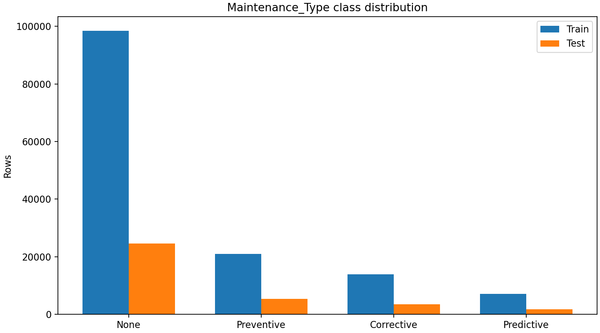
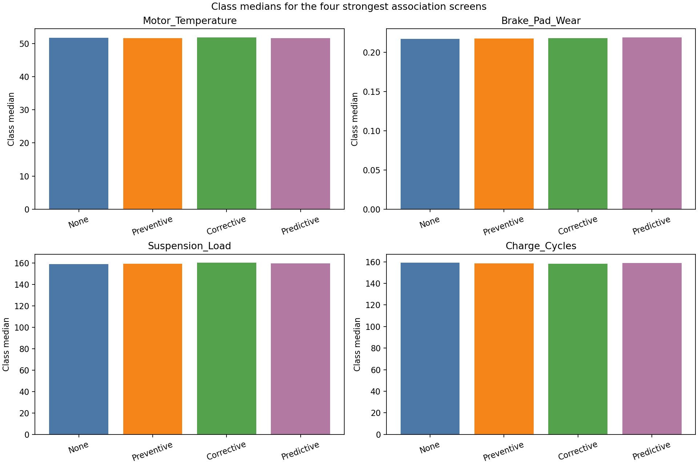
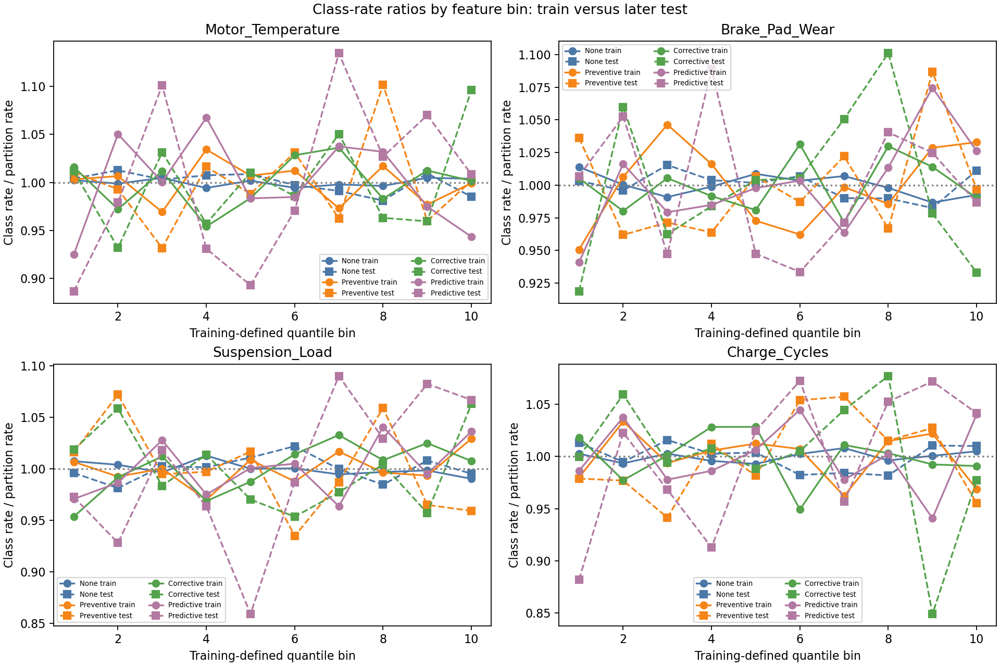
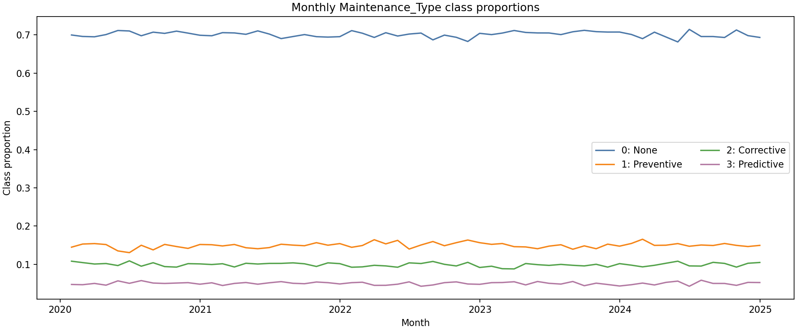

# Maintenance-Type Signal Analysis

## Scope

This investigation asks whether the same fixed 24 operational inputs used for Model 1 contain observable information for distinguishing the documented Model 2 target `Maintenance_Type`:

| Code | Class |
| ---: | --- |
| 0 | None |
| 1 | Preventive |
| 2 | Corrective |
| 3 | Predictive |

It is a descriptive investigation only. It does **not** train a classifier, tune a model, resample, engineer features, fit preprocessing, or change the raw CSV.

`X` contains only the approved operational allowlist: `SoC`, `SoH`, `Battery_Voltage`, `Battery_Current`, `Battery_Temperature`, `Charge_Cycles`, `Motor_Temperature`, `Motor_Vibration`, `Motor_Torque`, `Motor_RPM`, `Power_Consumption`, `Brake_Pad_Wear`, `Brake_Pressure`, `Reg_Brake_Efficiency`, `Tire_Pressure`, `Tire_Temperature`, `Suspension_Load`, `Ambient_Temperature`, `Ambient_Humidity`, `Load_Weight`, `Driving_Speed`, `Distance_Traveled`, `Idle_Time`, and `Route_Roughness`.

`Timestamp`, `Maintenance_Type`, `Failure_Probability`, `RUL`, `TTF`, and `Component_Health_Score` are excluded from `X`. The fact that a retained field sounds operational does not prove it is available before maintenance is decided; source-level timing remains unresolved.

## Chronology and class distribution

Rows are sorted by `Timestamp` and split without shuffling. The earliest 80% is used for all association measures and bin definitions. The latest 20% is used only to see whether earlier bin and interaction patterns persist. No transformation is fitted on the later period.

| Partition | Rows | None, 0 | Preventive, 1 | Corrective, 2 | Predictive, 3 |
| --- | ---: | ---: | ---: | ---: | ---: |
| Earliest 80% (train) | 140,314 | 98,471 (70.179%) | 20,921 (14.910%) | 13,896 (9.904%) | 7,026 (5.007%) |
| Latest 20% (test) | 35,079 | 24,487 (69.805%) | 5,321 (15.169%) | 3,506 (9.995%) | 1,765 (5.032%) |
| Full dataset | 175,393 | 122,958 (70.104%) | 26,242 (14.962%) | 17,402 (9.922%) | 8,791 (5.012%) |

The class mix is stable across the chronological holdout, but it is imbalanced: the `None` class is about 70% of records and `Predictive` about 5%. A future evaluation must not rely on accuracy alone.

## Feature comparison across the four classes

Every cell below is `mean / median / SD / P05–P95`, calculated from the earlier 80% only. The reusable analysis also records the 25th and 75th percentiles. Values use different units across rows, so comparisons are meaningful only within a feature.

| Feature | None, 0 | Preventive, 1 | Corrective, 2 | Predictive, 3 |
| --- | --- | --- | --- | --- |
| `Motor_Temperature` | 56.035 / 51.750 / 15.460 / 41.167–93.277 | 55.952 / 51.702 / 15.397 / 41.220–93.414 | 56.093 / 51.908 / 15.466 / 41.117–93.349 | 55.800 / 51.684 / 15.144 / 41.255–93.107 |
| `Brake_Pad_Wear` | 0.297 / 0.217 / 0.240 / 0.112–0.900 | 0.301 / 0.217 / 0.244 / 0.112–0.903 | 0.298 / 0.218 / 0.241 / 0.112–0.901 | 0.301 / 0.219 / 0.243 / 0.113–0.901 |
| `Suspension_Load` | 195.012 / 158.817 / 111.038 / 105.817–466.833 | 195.923 / 159.329 / 111.877 / 105.874–468.031 | 196.742 / 160.080 / 111.883 / 106.453–467.559 | 195.878 / 159.395 / 111.539 / 106.226–467.708 |
| `Charge_Cycles` | 217.901 / 159.059 / 164.694 / 105.884–634.791 | 216.131 / 158.641 / 162.556 / 105.779–629.501 | 217.596 / 158.296 / 164.468 / 105.755–633.255 | 219.102 / 158.933 / 166.711 / 106.202–636.869 |
| `Motor_Torque` | 180.188 / 158.988 / 77.068 / 105.917–366.667 | 179.150 / 158.414 / 76.269 / 106.049–365.555 | 178.352 / 158.199 / 75.644 / 105.625–364.124 | 178.345 / 158.859 / 75.393 / 105.806–364.841 |
| `Brake_Pressure` | 46.051 / 41.774 / 15.435 / 31.137–83.276 | 45.951 / 41.690 / 15.376 / 31.194–83.328 | 46.100 / 41.862 / 15.484 / 31.237–83.350 | 45.995 / 41.765 / 15.331 / 31.233–83.189 |
| `SoH` | 0.883 / 0.941 / 0.164 / 0.466–0.994 | 0.882 / 0.941 / 0.165 / 0.465–0.994 | 0.880 / 0.941 / 0.167 / 0.463–0.994 | 0.886 / 0.941 / 0.161 / 0.472–0.994 |
| `Battery_Temperature` | 33.399 / 30.893 / 8.652 / 25.587–55.028 | 33.338 / 30.867 / 8.586 / 25.567–54.910 | 33.460 / 30.927 / 8.738 / 25.595–55.186 | 33.198 / 30.807 / 8.428 / 25.581–54.519 |
| `SoC` | 0.780 / 0.882 / 0.292 / 0.066–0.988 | 0.782 / 0.883 / 0.290 / 0.065–0.989 | 0.781 / 0.884 / 0.291 / 0.063–0.989 | 0.780 / 0.880 / 0.290 / 0.067–0.988 |
| `Tire_Temperature` | 33.012 / 30.896 / 7.715 / 25.593–51.703 | 32.858 / 30.784 / 7.633 / 25.588–51.598 | 32.912 / 30.844 / 7.645 / 25.563–51.602 | 33.047 / 30.986 / 7.671 / 25.623–51.753 |
| `Driving_Speed` | 58.325 / 51.814 / 20.641 / 41.191–109.984 | 57.922 / 51.577 / 20.378 / 41.146–109.697 | 58.042 / 51.664 / 20.355 / 41.125–109.295 | 58.671 / 51.676 / 21.129 / 41.203–111.109 |
| `Ambient_Temperature` | 14.122 / 16.203 / 9.045 / -6.652–24.113 | 14.163 / 16.209 / 8.998 / -6.559–24.122 | 13.899 / 15.952 / 9.093 / -6.697–24.080 | 14.201 / 16.279 / 9.064 / -6.775–24.150 |
| `Reg_Brake_Efficiency` | 0.820 / 0.862 / 0.141 / 0.467–0.941 | 0.818 / 0.861 / 0.141 / 0.466–0.941 | 0.817 / 0.861 / 0.143 / 0.462–0.941 | 0.817 / 0.862 / 0.143 / 0.462–0.941 |
| `Power_Consumption` | 31.741 / 25.878 / 16.425 / 20.595–73.223 | 31.436 / 25.818 / 16.178 / 20.555–73.263 | 31.842 / 25.876 / 16.570 / 20.572–73.502 | 31.572 / 25.702 / 16.343 / 20.619–73.478 |
| `Distance_Traveled` | 15.352 / 5.871 / 25.596 / 0.582–83.267 | 15.515 / 5.904 / 25.668 / 0.621–82.884 | 15.717 / 5.883 / 26.041 / 0.607–83.678 | 15.779 / 5.927 / 26.198 / 0.582–85.087 |
| `Battery_Current` | -47.817 / -33.530 / 45.234 / -165.573–-12.335 | -47.497 / -33.339 / 45.129 / -165.639–-12.213 | -48.387 / -33.755 / 45.700 / -166.568–-12.425 | -48.235 / -33.541 / 45.787 / -168.833–-12.362 |
| `Motor_Vibration` | 0.524 / 0.377 / 0.434 / 0.218–1.674 | 0.519 / 0.374 / 0.429 / 0.217–1.654 | 0.528 / 0.377 / 0.439 / 0.217–1.667 | 0.523 / 0.378 / 0.432 / 0.217–1.663 |
| `Battery_Voltage` | 352.789 / 370.604 / 55.162 / 216.918–397.007 | 352.775 / 370.755 / 55.365 / 216.188–397.118 | 351.887 / 370.428 / 56.124 / 216.279–397.093 | 352.514 / 370.837 / 55.473 / 217.812–397.055 |
| `Motor_RPM` | 2237.240 / 1793.943 / 1190.046 / 1529.211–5341.480 | 2242.616 / 1795.487 / 1194.852 / 1529.293–5336.825 | 2223.147 / 1792.145 / 1176.506 / 1530.526–5310.113 | 2227.512 / 1795.565 / 1180.491 / 1529.674–5310.959 |
| `Route_Roughness` | 0.298 / 0.218 / 0.241 / 0.112–0.900 | 0.297 / 0.218 / 0.240 / 0.112–0.899 | 0.296 / 0.217 / 0.238 / 0.111–0.894 | 0.299 / 0.217 / 0.242 / 0.112–0.900 |
| `Idle_Time` | 1.549 / 0.585 / 2.578 / 0.059–8.355 | 1.534 / 0.583 / 2.555 / 0.061–8.277 | 1.563 / 0.587 / 2.599 / 0.058–8.463 | 1.550 / 0.578 / 2.580 / 0.059–8.342 |
| `Load_Weight` | 899.093 / 793.212 / 384.602 / 529.137–1831.355 | 900.937 / 792.636 / 385.695 / 528.548–1827.051 | 899.037 / 791.187 / 385.186 / 529.141–1832.772 | 895.795 / 792.873 / 379.054 / 532.070–1818.416 |
| `Ambient_Humidity` | 47.124 / 41.751 / 17.863 / 31.151–89.930 | 47.019 / 41.682 / 17.783 / 31.165–89.976 | 47.107 / 41.916 / 17.714 / 31.205–89.999 | 47.137 / 41.927 / 17.786 / 31.220–89.938 |
| `Tire_Pressure` | 30.997 / 32.058 / 3.852 / 21.648–34.702 | 31.005 / 32.043 / 3.847 / 21.644–34.704 | 31.022 / 32.083 / 3.829 / 21.696–34.708 | 30.992 / 32.076 / 3.855 / 21.726–34.665 |

All four class distributions overlap strongly. The small differences in means and medians are not useful by themselves because they are very small relative to each feature's class-level spread.

## Multiclass association measures

Three complementary screens are used on the earliest 80%:

- Eta-squared is the fraction of a feature's variance associated with the four class labels. It does not prove causality.
- Macro one-vs-rest ROC-AUC averages the orientation-neutral ability of one continuous feature to separate each class from the other three. `0.5` is chance-level.
- Mutual information is a non-linear dependence screen. It is not a model score and small values can be sampling variation.

| Feature | Eta-squared | Macro one-vs-rest AUC | Best class AUC | Best-separated class | Mutual information |
| --- | ---: | ---: | ---: | --- | ---: |
| `Motor_Temperature` | 0.000016 | 0.5011 | 0.5018 | Corrective | 0.001592 |
| `Brake_Pad_Wear` | 0.000059 | 0.5036 | 0.5066 | Predictive | 0.001374 |
| `Suspension_Load` | 0.000027 | 0.5037 | 0.5057 | Corrective | 0.001332 |
| `Charge_Cycles` | 0.000018 | 0.5013 | 0.5018 | Corrective | 0.000835 |
| `Motor_Torque` | **0.000082** | 0.5041 | 0.5052 | Corrective | 0.000764 |
| `Brake_Pressure` | 0.000007 | 0.5013 | 0.5021 | Preventive | 0.000690 |
| `SoH` | 0.000058 | 0.5025 | 0.5052 | Corrective | 0.000565 |
| `Battery_Temperature` | 0.000037 | 0.5020 | 0.5048 | Predictive | 0.000405 |
| `SoC` | 0.000006 | 0.5017 | 0.5036 | Predictive | 0.000370 |
| `Tire_Temperature` | 0.000062 | 0.5045 | 0.5065 | Preventive | 0.000126 |
| `Driving_Speed` | 0.000078 | 0.5036 | 0.5059 | Preventive | 0.000000 |
| `Ambient_Temperature` | 0.000065 | 0.5041 | **0.5090** | Corrective | 0.000000 |
| `Reg_Brake_Efficiency` | 0.000062 | 0.5044 | 0.5056 | None | 0.000000 |
| `Power_Consumption` | 0.000053 | 0.5032 | 0.5051 | Preventive | 0.000000 |
| `Distance_Traveled` | 0.000030 | 0.5021 | 0.5025 | Preventive | 0.000000 |
| `Battery_Current` | 0.000027 | 0.5033 | 0.5053 | Corrective | 0.000000 |
| `Motor_Vibration` | 0.000027 | 0.5020 | 0.5039 | Preventive | 0.000000 |
| `Battery_Voltage` | 0.000024 | 0.5013 | 0.5027 | Corrective | 0.000000 |
| `Motor_RPM` | 0.000019 | 0.5019 | 0.5039 | Corrective | 0.000000 |
| `Route_Roughness` | 0.000010 | 0.5014 | 0.5017 | Preventive | 0.000000 |
| `Idle_Time` | 0.000008 | 0.5005 | 0.5011 | Corrective | 0.000000 |
| `Load_Weight` | 0.000007 | 0.5005 | 0.5008 | Preventive | 0.000000 |
| `Ambient_Humidity` | 0.000004 | 0.5020 | 0.5028 | Predictive | 0.000000 |
| `Tire_Pressure` | 0.000004 | 0.5007 | 0.5015 | Corrective | 0.000000 |

The metric leaders do not agree: `Motor_Torque` has the largest eta-squared, `Motor_Temperature` the largest mutual-information estimate, and `Ambient_Temperature` the largest one-vs-rest AUC. All are still effectively null: the largest eta-squared is 0.000082, so class membership accounts for only 0.0082% of that feature's variance; the largest class AUC is 0.5090.

The weakest measured relationships include `Tire_Pressure` and `Ambient_Humidity` by eta-squared, and `Load_Weight` by macro AUC. This is descriptive evidence of weak association, not proof that a sensor is physically irrelevant.

## Nonlinear and interaction checks

The four largest mutual-information screens—`Motor_Temperature`, `Brake_Pad_Wear`, `Suspension_Load`, and `Charge_Cycles`—were divided into ten training-defined quantile bins. For each bin, the plot shows the class proportion relative to that partition's overall class proportion. A value of `1` means the bin matches the class base rate.

The class-rate ratios fluctuate around `1` without a monotonic pattern. Train and later-test fluctuations do not line up consistently, especially for the smaller Predictive class. This does not establish a usable nonlinear relationship.

All 276 two-feature combinations were also screened with training-defined 5 × 5 quantile grids. The largest training class-distribution deviation was 0.0260 for `Reg_Brake_Efficiency` plus `Ambient_Humidity`; its later-period pattern correlation was -0.0502. The next-largest pattern, `Motor_Torque` plus `Driving_Speed`, had a 0.0251 training deviation and 0.0720 agreement. Neither pattern persists.

Some low-effect pairs show moderate agreement by chance across 276 exploratory checks, while other pair patterns reverse direction. No pair combines a material, stable class-distribution change with credible out-of-time replication. There is no evidence here that an interaction model would recover useful predictive signal.

## Temporal behaviour

The full ordered dataset contains 60 complete months from January 2020 through December 2024. The incomplete final timestamp in January 2025 is excluded from monthly summaries. Monthly class proportions remain within narrow ranges:

| Class | Monthly minimum | Monthly maximum | Mean |
| --- | ---: | ---: | ---: |
| None | 68.145% | 71.424% | 70.105% |
| Preventive | 13.056% | 16.559% | 14.963% |
| Corrective | 8.804% | 10.903% | 9.921% |
| Predictive | 4.267% | 5.847% | 5.011% |

The following autocorrelations were calculated only on the earlier partition. The largest absolute value is 0.0053 (Corrective at 15 minutes), so class membership has no meaningful short-term, daily, or weekly persistence in this data.

| Class | 15 minutes | 1 hour | 1 day | 1 week |
| --- | ---: | ---: | ---: | ---: |
| None | -0.0001 | -0.0023 | 0.0026 | 0.0022 |
| Preventive | 0.0020 | -0.0006 | 0.0049 | 0.0029 |
| Corrective | 0.0053 | 0.0001 | 0.0026 | -0.0017 |
| Predictive | -0.0007 | -0.0024 | -0.0014 | 0.0017 |

The steady chronological class mix supports retaining a chronological split. It does not prove that `Maintenance_Type` is a pre-event label or that the sequence represents realistic maintenance episodes.

## Leakage and suspicious-relationship review

The Model 2 input selector returns exactly the 24 allowlisted operational fields. Tests confirm that every excluded field is absent from `X`, including `Failure_Probability`, even though it is a separate project target.

| Excluded column | Present in Model 2 `X`? | Observed evidence | Decision |
| --- | --- | --- | --- |
| `Timestamp` | No | Class shares are stable by year; timestamp still carries collection-order information. | Use only for chronology and auditing. |
| `Maintenance_Type` | No | It is the target. | Never include in `X`. |
| `Failure_Probability` | No | Full-data failure rates range from 9.772% to 10.342% across maintenance classes; training eta-squared is 0.000033. | Exclude because it is another label with unknown availability timing. |
| `RUL` | No | Training eta-squared is 0.000021; class means range 215.511–216.535. | Exclude because remaining useful life is future/event-relative by name. |
| `TTF` | No | Training eta-squared is 0.000016; class means range 129.247–130.288. | Exclude because time to failure is future/event-relative by name. |
| `Component_Health_Score` | No | Training eta-squared is 0.000010; class means range 0.7440–0.7478. | Exclude because lineage and timing are unknown. |

The weak empirical associations do not make a potentially post-outcome field safe. The exclusions remain necessary because the dataset does not document whether the labels and derived fields were recorded before, during, or after a maintenance action.

## Conclusion and recommendation

With the approved 24 raw operational features, `Maintenance_Type` does **not** currently appear learnable as a useful multiclass prediction task. The classes have almost identical feature distributions, individual AUCs near chance, negligible variance explained, no reproducible nonlinear bin pattern, no stable pairwise interaction, and almost no temporal persistence.

Training a multiclass baseline is **not justified as a signal-driven predictive experiment** at this point. It would likely default toward the majority `None` class and could give a misleading accuracy score. A baseline could only be justified later as an explicitly approved pipeline demonstration, not as evidence of a useful maintenance recommender.

Before authorizing any Model 2 model, obtain documentation that establishes:

1. Whether `Maintenance_Type` describes a future recommended action, a contemporaneous decision, or a completed post-event action.
2. The prediction horizon and the unit of observation, such as vehicle, component, or independent synthetic record.
3. When each sensor and derived field becomes available.

If that documentation confirms a future-facing, time-safe target, the next investigation should design past-only, domain-justified features and preserve chronological evaluation. No such features were created in this task.

## Reproducibility

- Reusable diagnostics: `src/eda/maintenance_type_signal.py`
- Signal script: `scripts/analyze_maintenance_type_signal.py`
- Tests: `tests/eda/test_maintenance_type_signal.py`, `tests/preprocessing/test_cleaning.py`, and `tests/preprocessing/test_validation.py`
- Figures: `reports/figures/maintenance_type_class_distribution.png`, `reports/figures/maintenance_type_class_medians.png`, `reports/figures/maintenance_type_binned_class_rates.png`, and `reports/figures/maintenance_type_temporal_patterns.png`
- No raw data, Model 1 code, model artifact, or Model 2 classifier was created or changed.
