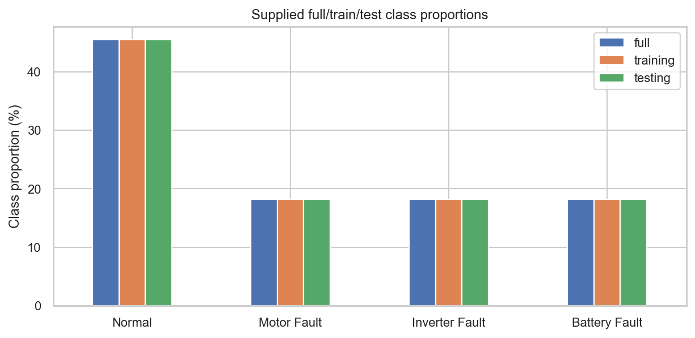
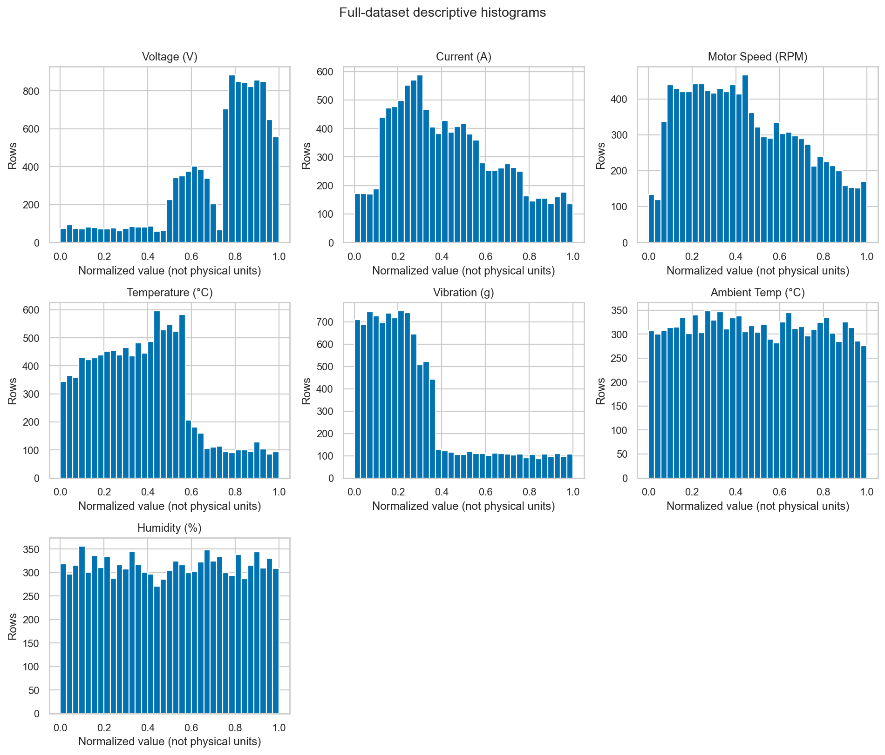
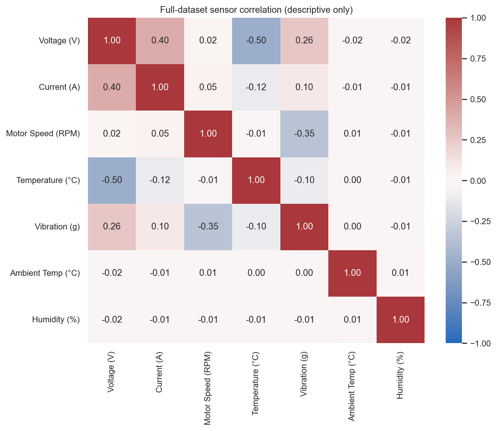
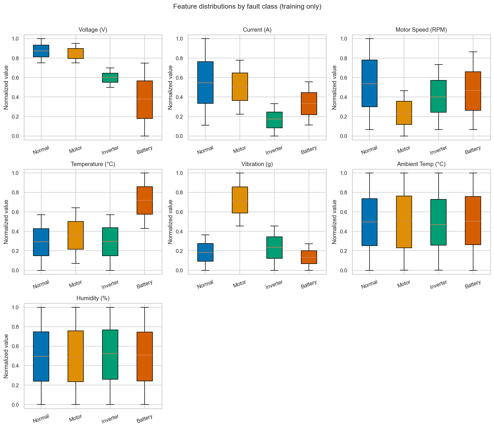
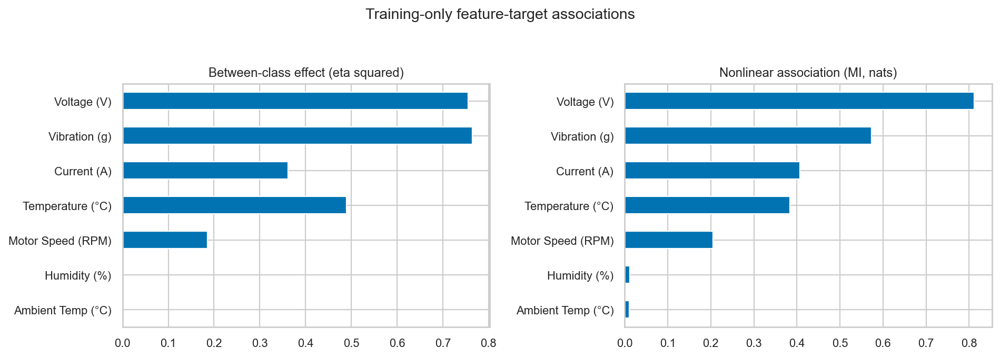
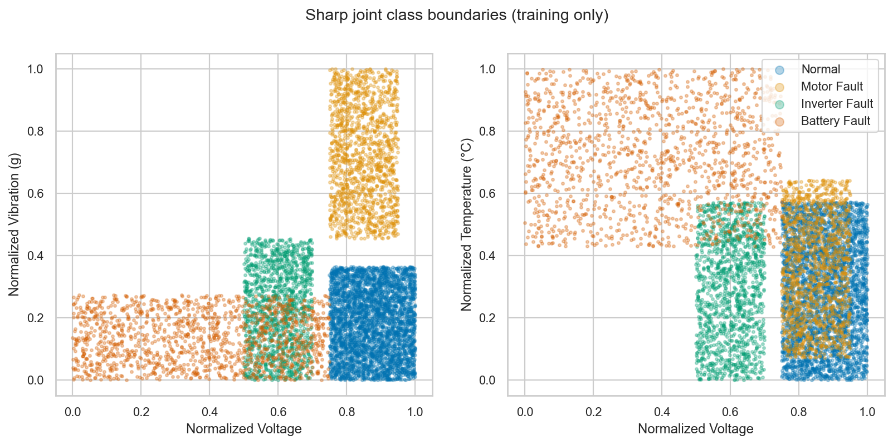

# Experiment 2: NEV EDA and Signal Review

## Conclusion

This dataset has strong, unusually clean fault-class signal. Voltage and
Vibration are most informative, followed by Current and Temperature. Motor
Speed adds a weaker relationship. Ambient Temp and Humidity show very little
association. These findings support the approved classifier comparison but
also raise a serious realism/provenance question: class-specific sensor ranges
may reflect controlled or synthetic label-generation rules. Synthetic origin
is **not confirmed** by the supplied files.

Experiment 1 remains a separate retained negative/weak-signal experiment.
NEV results do not revise its Model 1 or Model 2 conclusions.

Experiment 2 is a **proof-of-concept EV fault-diagnosis module** supporting
Normal / Motor Fault / Inverter Fault / Battery Fault diagnosis. Its shallow
depth-3 tree achieved approximately **0.979 CV macro F1**, confirming unusually
easy class separation within this dataset. Random Forest's final supplied-test
results are **Accuracy = 0.994242, Macro F1 = 0.992082,
OvR ROC-AUC = 0.999698**. The extremely high performance describes this
supplied dataset, **not evidence of equivalent real-world OEM performance**.

## Analysis boundaries

The full 11,000 rows are used for descriptive histograms/correlation and split
validation only. All feature-vs-label analyses, decision-rule diagnostics,
class summaries and candidate selection use the supplied **7,700 training
rows only**. Test labels do not determine feature choices, preprocessing,
hyperparameters or model selection. All seven original sensor features remain
in the candidates; no new feature is introduced.

The label mapping is 0 Normal, 1 Motor Fault, 2 Inverter Fault, 3 Battery Fault.
These numeric codes are categories, not an ordered severity scale. Therefore
Pearson correlation against the numeric target code is not used. Features
are already normalized approximately to [0,1], despite the units in their
unchanged names. Original physical-unit normalization parameters are not
currently known.

## Class distribution and descriptive plots

Normal constitutes 45.4545% and each fault class 18.1818% in full/train/test.
Training counts are 3,500 / 1,400 / 1,400 / 1,400. This is moderate imbalance;
macro F1 gives each class equal weight during model selection.







The correlation matrix describes sensor co-variation, not causality or
independent validation. Marginal distributions mix different class ranges.
Ambient Temp and Humidity cover [0,1] broadly in every class.

## Comparing every sensor across classes

Training-only class means below are normalized values, not physical readings.
`signal.json` retains each feature/class's count, mean, SD, min, max and
5/25/50/75/95 percentiles for complete distribution comparisons.

| Feature | Normal mean | Motor mean | Inverter mean | Battery mean |
| --- | ---: | ---: | ---: | ---: |
| Voltage (V) | 0.874056 | 0.847767 | 0.600807 | 0.373984 |
| Current (A) | 0.550483 | 0.501526 | 0.167567 | 0.331587 |
| Motor Speed (RPM) | 0.536554 | 0.235595 | 0.402836 | 0.464818 |
| Temperature (°C) | 0.289237 | 0.357840 | 0.291072 | 0.716755 |
| Vibration (g) | 0.183840 | 0.721194 | 0.231702 | 0.134053 |
| Ambient Temp (°C) | 0.494814 | 0.499476 | 0.489258 | 0.509054 |
| Humidity (%) | 0.498410 | 0.492962 | 0.511196 | 0.498509 |



- **Voltage:** Normal/Motor occupy about 0.75–1; Inverter about 0.50–0.70;
  Battery 0–0.75. Normal and Motor overlap strongly in Voltage alone.
- **Current:** Inverter is confined to about 0–0.333; the other classes have
  higher but overlapping ranges. It helps distinguish Inverter from Battery.
- **Motor Speed:** Motor occupies about 0–0.466. Other classes overlap, so it
  cannot identify all four labels reliably by itself.
- **Temperature:** Battery is shifted upward (about 0.429–1), while
  Normal/Inverter are about 0–0.571. Some overlap remains.
- **Vibration:** Motor's training minimum is 0.454594, above every other
  class's maximum (0.454515). A single threshold perfectly separates Motor
  from the rest in these training observations, but not the other three
  classes from each other.
- **Ambient Temp and Humidity:** Very similar centers, broad overlapping
  ranges and little discriminating information.

Box plots omit plotted fliers only for readability; all rows remain in the
analysis and models. Exact outlier counts are documented in report 08.

## Association measures and individual predictive power

Eta squared measures the fraction of variation explained by differences in
class means (0–1). Mutual information estimates nonlinear dependence in nats;
small positive estimates can occur from sampling noise. Neither implies
causality. A fixed depth-4 univariate decision tree, with minimum leaf size 10,
is evaluated in five stratified training-only folds as a diagnostic, not as a
selected deployment model. There is no depth search or test-set tuning.

| Feature | Eta squared | MI (nats) | Univariate CV macro F1 |
| --- | ---: | ---: | ---: |
| Voltage (V) | 0.755029 | 0.812323 | 0.638968 |
| Vibration (g) | 0.764169 | 0.573544 | 0.517242 |
| Current (A) | 0.361240 | 0.406977 | 0.313544 |
| Temperature (°C) | 0.489709 | 0.384154 | 0.410613 |
| Motor Speed (RPM) | 0.185912 | 0.204518 | 0.228577 |
| Ambient Temp (°C) | 0.000498 | 0.010759 | 0.159840 |
| Humidity (%) | 0.000391 | 0.011730 | 0.160482 |

Direction-free one-vs-rest raw-feature AUC is also recorded in `signal.json`
as `max(AUC, 1-AUC)` to allow either direction. These are descriptive
training statistics, not held-out generalization scores. Vibration/Motor AUC
is 1.0; Temperature/Battery is 0.960871; Voltage/Battery is 0.954596.
Ambient Temp/Humidity one-vs-rest AUCs are approximately 0.50–0.515.



## Nonlinear combinations and simple label rules



Combining features separates classes far better than one feature alone.
Voltage divides high-voltage Normal/Motor from lower-voltage Inverter/Battery;
Vibration separates Normal/Motor, and Temperature plus Voltage separates much
of Inverter/Battery. These are threshold/interaction patterns that trees can
represent without explicitly engineered features.

A **fixed depth-3** tree with minimum leaf size 10 achieves training-only
five-fold macro F1 **0.979072**. Its fitted-on-training illustrative rules are:

```text
Voltage <= 0.749679:
    Temperature <= 0.571174:
        Voltage <= 0.499052: Battery
        otherwise: Inverter
    otherwise: Battery
Voltage > 0.749679:
    Vibration <= 0.409094: Normal
    otherwise: Motor
```

These thresholds are in normalized space and are dataset-specific, not
engineering safety limits. The tree is not perfect and some Battery/Inverter
overlap remains. Near-perfect separation by a few shallow rules is evidence
of an unusually simple classification problem, not proof of leakage,
synthetic origin or physical fault causation. The generating/labeling protocol
must be obtained before making stronger claims.

## Leakage, timing and limitations

The target is absent from X; only the fixed seven-sensor allowlist is used.
There are no explicit RUL, future-failure or maintenance-output fields.
Zero exact train/test row and sensor-vector overlap was verified. These checks
do not exclude shared vehicles, correlated runs, upstream normalization
leakage or labels constructed directly from sensor ranges.

There are **no timestamps, vehicle IDs or time-to-failure observations**.
No temporal analysis, chronological holdout or cross-vehicle validation can
be established from this schema. Sensor/label timing remains undocumented.
This experiment supports **fault diagnosis**, not RUL prediction or a warning
that a vehicle will fail at some future horizon.
Therefore temporal generalization and cross-vehicle generalization cannot be
claimed. RUL will be implemented as a separate module using an appropriate
degradation/time-to-failure dataset; Experiment 2 does not provide Remaining
Useful Life prediction.

Full-dataset descriptive plots were requested and are not an independent
blind holdout exercise. Predictive diagnostics and selection remain training
only; test predictive scores are calculated only after selection. Any later
test-guided change would require new independent evaluation data.

## Recommendation

The approved Logistic Regression/Random Forest/HistGradientBoosting comparison
is justified for this educational dataset. Do not add engineered thresholds,
drop weak sensors or tune against the test scores in this run. Before claiming
real-world usefulness, obtain the source/license, label-generation protocol,
normalization parameters and an independent vehicle/time-aware dataset.

The completed candidate results are in report 10. No SMOTE, SVM, XGBoost,
feature engineering, threshold tuning, website or API was added.
