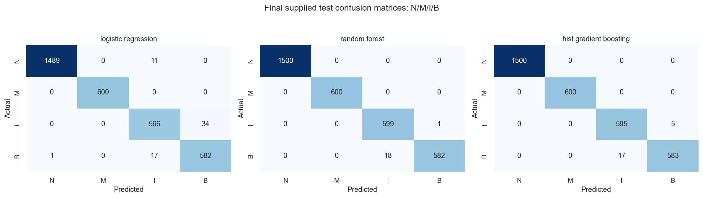
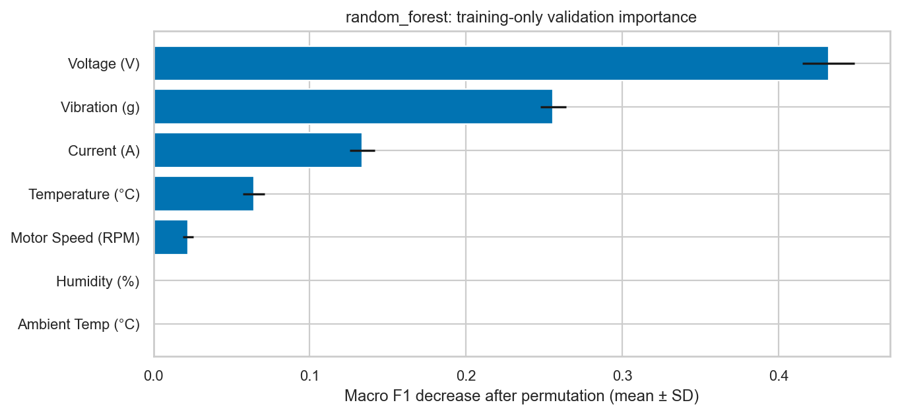

# Experiment 2: NEV Fault Classifier Comparison

## Outcome

**Random Forest was selected using training-only cross-validation before
test evaluation.** Its supplied-test accuracy is **0.994242**, macro F1
**0.992082**, and macro one-vs-rest ROC-AUC **0.999698**. These are strong
same-dataset diagnosis results, not evidence of future-failure, cross-vehicle
or real-world performance. The unusually sharp class boundaries in report 09
are a major limitation.

Experiment 2 is a **proof-of-concept EV fault-diagnosis module** supporting
Normal / Motor Fault / Inverter Fault / Battery Fault diagnosis. Class
boundaries are unusually easy to separate: a shallow depth-3 tree achieved
approximately **0.979 CV macro F1**. The extremely high Random Forest scores
describe performance on this supplied dataset, **not evidence of equivalent
real-world OEM performance**. Inputs are already normalized approximately to
[0,1]; original physical-unit normalization parameters are not currently
known. The dataset contains no timestamp or vehicle identifier, therefore
temporal generalization and cross-vehicle generalization cannot be claimed.

Experiment 2 **does not provide Remaining Useful Life prediction**. RUL will
be implemented as a separate module using an appropriate
degradation/time-to-failure dataset, with separate implementation approval.

## Inputs, target and split

- X: the seven original features, in order: `Voltage (V)`, `Current (A)`,
  `Motor Speed (RPM)`, `Temperature (°C)`, `Vibration (g)`,
  `Ambient Temp (°C)`, `Humidity (%)`.
- y: `Fault Label`, with 0 Normal, 1 Motor Fault, 2 Inverter Fault,
  3 Battery Fault. The target never enters X.
- Training X shape: **(7,700, 7)**; y shape: **(7,700,)**.
- Test X shape: **(3,300, 7)**; y shape: **(3,300,)**.
- Class counts train: 3,500 / 1,400 / 1,400 / 1,400;
  test: 1,500 / 600 / 600 / 600, in class order 0/1/2/3.
- The supplied 70/30 membership is preserved. No `train_test_split` is used.
- CV: five-fold `StratifiedKFold(shuffle=True, random_state=42)` **inside the
  supplied training file only**. This does not shuffle/reassign the supplied
  final train/test boundary and is not claimed to be temporal/grouped CV.

The selection criterion was mean CV macro F1, giving equal importance to
each class rather than optimizing accuracy alone. Fixed configurations were
chosen before final test evaluation. There was no grid/random search, SMOTE,
feature engineering, threshold adjustment or test-driven model refinement.

## Configurations and preprocessing

| Candidate | Explicit configuration | Pipeline preprocessing |
| --- | --- | --- |
| Logistic Regression | balanced class weights, lbfgs, max_iter=2000, random_state=42; default C=1, L2 regularization | Existing median imputer + StandardScaler in ColumnTransformer |
| Random Forest | n_estimators=200, balanced class weights, random_state=42, n_jobs=-1; default max_depth=None, min_samples_leaf=1, max_features=sqrt | Named-column median imputer in ColumnTransformer; no scaling |
| HistGradientBoosting | max_iter=150, learning_rate=0.1, max_leaf_nodes=31, l2_regularization=1, early_stopping=False, random_state=42; other sklearn defaults | Named-column median imputer in ColumnTransformer; no scaling |

All learned preprocessing is fitted within each training fold, then on the
7,700 training observations for the final pipelines. No imputation changed
observed values because there were no missing values. Existing normalized
inputs are retained. LR's additional standardization is learned from training
only; it does not attempt to recover raw physical units.

XGBoost and SHAP are not installed, so HistGradientBoosting and permutation
importance were used without installing packages. Optional SVM was omitted
because the three required candidates already provide a linear/tree
comparison. Logistic Regression converged within the specified limit.

## Training-only selection

| Model | CV accuracy | CV macro F1 mean | CV macro F1 SD | CV macro OvR ROC-AUC |
| --- | ---: | ---: | ---: | ---: |
| Logistic Regression | 0.982338 | 0.977256 | 0.004770 | 0.999281 |
| Random Forest | 0.995974 | 0.994515 | 0.001374 | 0.999838 |
| HistGradientBoosting | 0.995455 | 0.993750 | 0.000565 | 0.999846 |

All fold scores, macro precision and macro recall are saved in
`reports/metrics/experiment_2/selection_before_test.json`, persisted **before**
final test evaluation. SD is descriptive across five folds, not a confidence
interval or significance test. The small tree-model gap is not established as
statistically meaningful. The pre-test selection remains Random Forest.

## Final supplied-test comparison

| Model | Accuracy | Macro precision | Macro recall | Macro F1 | Macro OvR ROC-AUC |
| --- | ---: | ---: | ---: | ---: | ---: |
| Logistic Regression | 0.980909 | 0.974249 | 0.976500 | 0.975324 | 0.999191 |
| Random Forest | 0.994242 | 0.992278 | 0.992083 | 0.992082 | 0.999698 |
| HistGradientBoosting | 0.993333 | 0.990930 | 0.990833 | 0.990832 | 0.999759 |

ROC-AUC uses `predict_proba` columns in sorted class order, macro-averaged
one-vs-rest. It measures ranking, not calibration. Predictions use each
classifier's default multiclass decision rule; no threshold was tuned.

### Per-class metrics

| Model | Class | Precision | Recall | F1 | Support |
| --- | --- | ---: | ---: | ---: | ---: |
| Logistic Regression | Normal | 0.999329 | 0.992667 | 0.995987 | 1,500 |
| Logistic Regression | Motor | 1.000000 | 1.000000 | 1.000000 | 600 |
| Logistic Regression | Inverter | 0.952862 | 0.943333 | 0.948074 | 600 |
| Logistic Regression | Battery | 0.944805 | 0.970000 | 0.957237 | 600 |
| Random Forest | Normal | 1.000000 | 1.000000 | 1.000000 | 1,500 |
| Random Forest | Motor | 1.000000 | 1.000000 | 1.000000 | 600 |
| Random Forest | Inverter | 0.970827 | 0.998333 | 0.984388 | 600 |
| Random Forest | Battery | 0.998285 | 0.970000 | 0.983939 | 600 |
| HistGradientBoosting | Normal | 1.000000 | 1.000000 | 1.000000 | 1,500 |
| HistGradientBoosting | Motor | 1.000000 | 1.000000 | 1.000000 | 600 |
| HistGradientBoosting | Inverter | 0.972222 | 0.991667 | 0.981848 | 600 |
| HistGradientBoosting | Battery | 0.991497 | 0.971667 | 0.981481 | 600 |

### Confusion matrices

Rows = actual; columns = predicted. Both use **Normal, Motor, Inverter,
Battery** (0,1,2,3) order.

```text
Logistic Regression
[[1489,   0,  11,   0],
 [   0, 600,   0,   0],
 [   0,   0, 566,  34],
 [   1,   0,  17, 582]]

Random Forest
[[1500,   0,   0,   0],
 [   0, 600,   0,   0],
 [   0,   0, 599,   1],
 [   0,   0,  18, 582]]

HistGradientBoosting
[[1500,   0,   0,   0],
 [   0, 600,   0,   0],
 [   0,   0, 595,   5],
 [   0,   0,  17, 583]]
```

Random Forest makes 19 errors: 18 Battery cases classified as Inverter and one
Inverter classified as Battery. Thus its high overall score does not eliminate
fault-specific errors. LR makes 63 errors and HistGradientBoosting 22.



## Tree interpretation

Permutation importance uses the best tree selected by CV (Random Forest),
trained on 6,160 training observations and evaluated on a **1,540-row
training-only validation fold**, repeated ten times per feature with seed 42.
No test data is used for interpretation/model development. This table is the
decrease in validation macro F1 after shuffling one column:

| Feature | Mean F1 decrease | SD |
| --- | ---: | ---: |
| Voltage (V) | 0.431933 | 0.016764 |
| Vibration (g) | 0.255768 | 0.008170 |
| Current (A) | 0.133583 | 0.008176 |
| Temperature (°C) | 0.064122 | 0.007031 |
| Motor Speed (RPM) | 0.022173 | 0.003324 |
| Ambient Temp (°C) | 0.000000 | 0.000000 |
| Humidity (%) | 0.000000 | 0.000000 |



The final saved Random Forest, fitted on all training observations, has
impurity importances: Voltage 0.357753; Vibration 0.286546; Temperature
0.176897; Current 0.111762; Motor Speed 0.060334; Ambient Temp 0.003569;
Humidity 0.003139. The validation-fold model's impurity values are separately
retained in the metrics JSON and need not equal the final model's values.

Voltage and Vibration dominate model dependence. Importances are not causal
effects, physical failure mechanisms or additive contributions to accuracy.
They can change with correlated features, sample choice or data distribution.
Permutation may also create combinations outside the dataset's original
class-specific ranges. One validation fold is a limited interpretation check,
not evidence that Ambient Temp/Humidity can never matter in real vehicles.
SHAP was not added because it is unavailable and unnecessary for this scope.

## Saved inference and reproducibility

- Pipeline: `models/experiment_2/nev_fault_pipeline.joblib`.
- Metadata: `models/experiment_2/metadata.json`.
- Machine-readable scores: `reports/metrics/experiment_2/model_comparison.json`.
- Reusable inference: `src/prediction/nev_fault.py::predict_nev_faults`.
- Entry point: `python scripts/run_nev_experiment.py` (approved full run).
- Environment: Python 3.13.9, scikit-learn 1.7.2, pandas 2.3.3,
  NumPy 2.3.5, joblib 1.5.2. All random seeds are 42; full estimator defaults
  and raw SHA-256 hashes are saved in metadata.

The serialized pipeline includes named feature selection, median imputation
and the classifier. Loading it back reproduced predictions/probabilities
exactly on the verification sample. The inference helper accepts the seven
normalized named columns in any order, returns fault code/name plus four
probabilities, and rejects extra/target, missing, nonnumeric, nonfinite and
out-of-range inputs. It never guesses a raw-to-normalized conversion.

Model loading uses joblib: load only trusted local artifacts and preferably
the recorded package versions. No website/API is implemented. Model metadata,
the four statistical/metric snapshots and eight report figures are tracked
with the approved documentation. Raw CSVs and the trained `.joblib` pipeline
remain local and Git-ignored. Pulling the repository does not download a
fitted model; collaborators needing inference must separately obtain the
trusted pipeline and compatible dependencies.

## Limitations and review boundary

1. Near-deterministic class ranges and a depth-3 CV score around 0.979 suggest
   a simple rule-like problem. Realism and label-generation provenance remain
   unresolved; no synthetic-origin claim is made.
2. No timestamps or vehicle IDs: no future-time or unseen-vehicle claim.
3. Normalization parameters and whether normalization used test data are
   unknown. Our pipeline is train-only, but unknown upstream leakage cannot
   be ruled out.
4. No real physical-unit inference is possible from the supplied files.
5. Same-source supplied test observations may not be independent of training
   groups. Exact overlap checks cannot establish group independence.
6. Class proportions are curated-looking and not established fleet prevalence.
   Probabilities are uncalibrated; no deployment/safety claim is made.
7. This is **fault diagnosis**, not RUL or a future failure warning. RUL needs
   a separate degradation/time-to-failure dataset and future approval.
8. The final test is now observed. Further test-guided experiments cannot treat
   it as a new untouched validation set.

The run produced harmless host warnings about physical-core detection and
Matplotlib/font caches; it completed, plots were generated and inspected, and
no model convergence warning occurred. No dependencies were installed.

The complete suite passes **44 tests** (27 retained tests plus 17 Experiment 2
tests), including schema, mapping, split membership/overlap, unchanged raw
bytes, roundoff tolerance, feature order, training-only fitted statistics,
CV selection, inference serialization and output classes. Experiment 2 has
been reviewed and approved for repository publication. The final documentation
pass and synchronization preserve all recorded metrics without retraining
the experimental models. Further modeling experiments require new approval.
